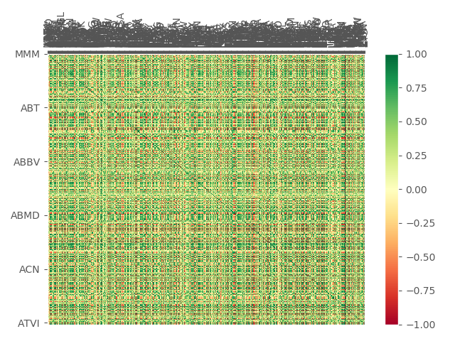

# Momentum Bull Strategy

### Overview
* Simple Momentum Strategy
    1. Scrape data for SP500 tickers
    2. Predict Probabilty of +/- 10% move (within next week) for each stock using SciKitLearn's VotingClassifier
    3. Long top 5 stocks with strongest probability of 10% move, short 5 stocks with strongest probabilty of -10% move. Only long if stock's 50D moving average is above 200D. 

### Organization
* ```/data```: Data collection scripts. Currently ```get_price_data.py``` pulls daily price data for entire SP500
* ```/feature_ext```: Feature Extraction Scripts. ```price_momentum.py``` creates feature / label set from price data. Features: Daily price data (% change). Labels: (-1, 0, 1) corresponding to if there was a -10% price move (-1), no large price move (0) or +10% price move within the week.
* ```/models```: Currently the only model is ```votingClassifierM.py```, based on features/labels from ```price_momentum.py```, predicts probabilty of +/- 10% move within week given current price data.
    * TODO: Experiment with different supervised learning algorithms
* ```/strats```: Jupyter Notebooks to visualize and run the strategies.

### Data Visualization:
* ```data/heatmap.py``` creates a massive correlation matrix of returns for all SP500 stocks. (Unreadable in screenshot, but interactive if run in jupyter notebook):



### Goal:
* To split this repo into:
    * Data collection and processing sources
    * Models for prediction / Strategy generation
    * Some time of risk allocation / paper trading / analytics (integrate with alpaca?)